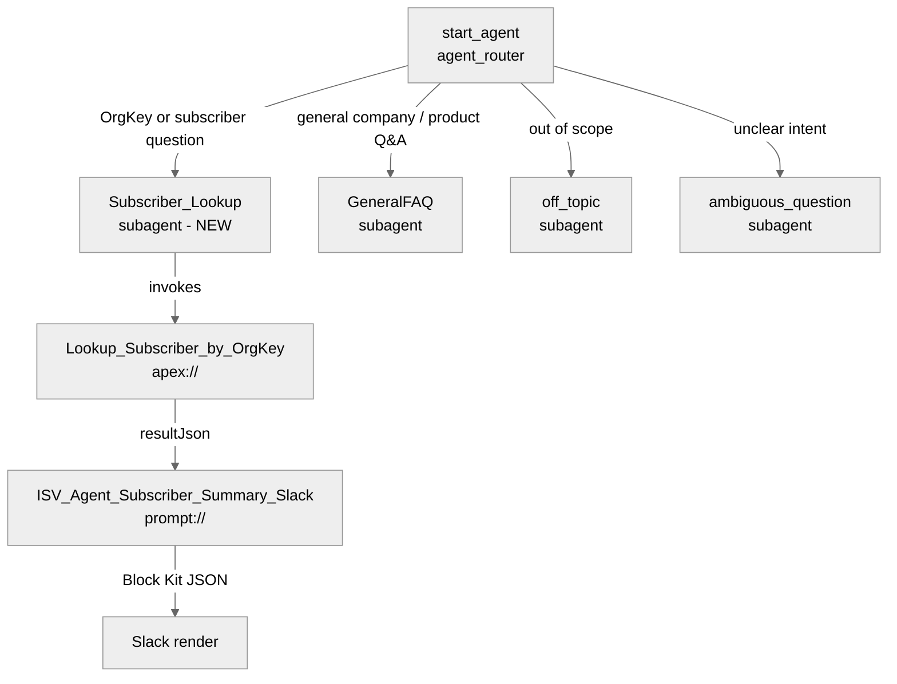

# Agent Spec: Subscriber_Agent

> Scope of this revision: adding a new `Subscriber_Lookup` subagent to the existing `Subscriber_Agent` bundle. The subagent wraps the `Lookup_Subscriber_by_OrgKey` Apex invocable and hands its output to the `ISV_Agent_Subscriber_Summary_Slack` prompt template so Slack renders a Block Kit card.

## Purpose & Scope

Subscriber_Agent is an internal Agentforce Employee Agent that helps AppExchange Support Engineers and ISV Release Managers answer subscriber-health questions from Slack without leaving the channel. The agent is template-based (`EmployeeCopilot__AgentforceEmployeeAgent`) and uses a classifier-style `start_agent agent_router` that transitions into specialized `subagent` blocks. It already includes the standard `GeneralFAQ`, `off_topic`, and `ambiguous_question` subagents. This revision adds a `Subscriber_Lookup` subagent dedicated to Use Case 1 (subscriber lookup by OrgKey).

## Behavioral Intent

- The agent must never paraphrase the Subscriber Summary output — the Slack Block Kit JSON produced by the prompt template is the entire user-facing response.
- OrgKeys are passed through to the backing Apex verbatim. The agent never normalizes, pads, truncates, or lowercases them.
- The `Lookup_Subscriber_by_OrgKey` Apex invocable owns all validation: empty → error, malformed → error, 6–14 char alphanumeric → prefix match, 15/18 char → exact match. The agent does not duplicate that logic.
- If the user provides no OrgKey and none can be extracted from conversation, the agent asks for one rather than guessing.
- Non-subscriber-lookup questions (license status, push upgrade history, adoption metrics, cross-subscriber analytics) are out of scope for this subagent — the router handles them via `GeneralFAQ` / `off_topic`.
- Preserved from the existing agent: welcome message, `off_topic` / `ambiguous_question` guardrails, `GeneralFAQ` knowledge search via `EmployeeCopilot__AnswerQuestionsWithKnowledge`, the five linked messaging variables that supply Slack session context, the internal `VerifiedCustomerId` variable, the empty `connection slack:` block, and the `EndUserLanguage`-driven locale.

## Topic Map



## Variables

No variable changes in this revision. All existing variables are preserved:

- `EndUserId` (linked string) — MessagingEndUserId from the session. External visibility.
- `RoutableId` (linked string) — MessagingSession Id. External visibility.
- `ContactId` (linked string) — MessagingEndUser ContactId. External visibility.
- `EndUserLanguage` (linked string) — session locale.
- `currentAppName`, `currentObjectApiName`, `currentPageType`, `currentRecordId` (mutable string = "") — UI context for in-app Agentforce surfaces. External visibility.
- `VerifiedCustomerId` (mutable string = "") — Internal verification state.

> **Note on linked variables on an employee agent.** The core-language reference says MessagingSession linked variables and `connection messaging:` are service-agent-only. The existing bundle intentionally keeps the messaging-session variables + an empty `connection slack:` block because the agent is deployed through the Agentforce-for-Slack connector, which supplies these via the native Slack↔SF mapping. We are preserving this configuration, not introducing it.

## Actions & Backing Logic

### Lookup_Subscriber_by_OrgKey (Subscriber_Lookup subagent)

- **Target:** `apex://AgentSubscriberLookup` (Apex invocable in [force-app/main/default/classes/AgentSubscriberLookup.cls](force-app/main/default/classes/AgentSubscriberLookup.cls))
- **Backing Status:** EXISTS — Apex class, wrappers class, and test class deployed in this project.

#### Inputs

| Name | Type | Required | Source |
|------|------|----------|--------|
| `orgKey` | string | Yes | User input (LLM slot-fill from the utterance) |

#### Outputs

| Name | Type | Visible to User? | Source | Notes |
|------|------|-------------------|--------|-------|
| `result` | object (`AgentSubscriberWrappers.LookupResult`) | No | Apex | Typed payload — not rendered directly. `filter_from_agent: True`. |
| `resultJson` | string | No | Apex (`JSON.serialize(result)`) | Fed into the prompt template input `Input:Lookup_Result`. `filter_from_agent: True`. |

#### Stubbing Requirement

None. Existing Apex:
- [AgentSubscriberLookup.cls](force-app/main/default/classes/AgentSubscriberLookup.cls) — `@InvocableMethod` entry point with validation + routing.
- [AgentSubscriberWrappers.cls](force-app/main/default/classes/AgentSubscriberWrappers.cls) — `SubscriberSummary`, `SubscriberMatch`, `LookupResult` wrappers.
- [AgentSubscriberLookupTest.cls](force-app/main/default/classes/AgentSubscriberLookupTest.cls) — 11 HttpCalloutMock-backed tests.

### Render_Subscriber_Summary_Slack (Subscriber_Lookup subagent)

- **Target:** `generatePromptResponse://ISV_Agent_Subscriber_Summary_Slack` (Prompt Template in [force-app/main/default/genAiPromptTemplates/](force-app/main/default/genAiPromptTemplates/ISV_Agent_Subscriber_Summary_Slack.genAiPromptTemplate-meta.xml))
- **Backing Status:** EXISTS.

#### Inputs

| Name | Type | Required | Source |
|------|------|----------|--------|
| `"Input:Lookup_Result"` | string | Yes | `@outputs.resultJson` from the Lookup action (captured into `subscriber_result_json`). |

#### Outputs

| Name | Type | Visible to User? | Source | Notes |
|------|------|-------------------|--------|-------|
| `promptResponse` | string | Yes | Prompt template | Slack Block Kit JSON. Rendered directly by Agentforce-for-Slack. `is_displayable: True`, `filter_from_agent: False`. |

### Preserved: AnswerQuestionsWithKnowledge (GeneralFAQ subagent)

Unchanged. Standard `EmployeeCopilot__AnswerQuestionsWithKnowledge` → `standardInvocableAction://streamKnowledgeSearch`. EXISTS.

## Subagent Flow

```
User utterance in Slack
        │
        ▼
agent_router (start_agent)
   - If message contains an OrgKey-like token (15/18 char alphanumeric)
     OR asks about a specific subscriber / org version / org health
     → transition to @subagent.Subscriber_Lookup
   - If general company/product/policy question
     → transition to @subagent.GeneralFAQ
   - If off-topic → @subagent.off_topic
   - If ambiguous → @subagent.ambiguous_question
        │
        ▼
Subscriber_Lookup (new)
   reasoning (deterministic):
     - Slot-fill orgKey from utterance via @utils.setVariables into subscriber_org_key
     - run @actions.Lookup_Subscriber_by_OrgKey with orgKey = @variables.subscriber_org_key
         set @variables.subscriber_result_json = @outputs.resultJson
     - run @actions.Render_Subscriber_Summary_Slack with "Input:Lookup_Result" = @variables.subscriber_result_json
         set @variables.slack_block_kit = @outputs.promptResponse
   | Respond to the user with exactly the value of @variables.slack_block_kit
     and nothing else. Do NOT add prose, do NOT wrap in a code fence, do NOT
     paraphrase, do NOT summarize. The JSON will be rendered natively by Slack.
```

> Two **new local mutable variables** are needed for this subagent (bundle-local, not schema changes): `subscriber_org_key: mutable string = ""` and `subscriber_result_json: mutable string = ""`, `slack_block_kit: mutable string = ""`. These will be added to the top-level `variables:` block.

## Gating Logic

- `Lookup_Subscriber_by_OrgKey` visibility: `available when @variables.subscriber_org_key != ""` — prevents the action from being callable before the agent has captured an OrgKey. If the user hasn't provided one, the reasoning instructions will use `@utils.setVariables` to collect it first.
- `Render_Subscriber_Summary_Slack` visibility: `available when @variables.subscriber_result_json != ""` — the renderer cannot run before the Apex invocable has produced JSON.

Rationale: these gates prevent the two most common action loops — (a) the LLM calling the lookup action repeatedly with the same OrgKey, and (b) the renderer firing on empty input and producing a malformed Block Kit that would appear as raw text in Slack.

## Architecture Pattern

Hub-and-spoke with the template-provided `start_agent agent_router` as the hub and each `subagent` as a spoke. Matches the existing bundle's established pattern — `GeneralFAQ`, `off_topic`, `ambiguous_question` are all spokes reached via `@utils.transition to @subagent.X`. The new `Subscriber_Lookup` subagent fits this exact shape.

## Agent Configuration

- **developer_name:** `Subscriber_Agent`
- **agent_label:** `Subscriber Agent`
- **agent_type:** `AgentforceEmployeeAgent` — chosen because the users are internal (AppExchange Support, Release Managers) and there is no `default_agent_user` in the file.
- **agent_template:** `EmployeeCopilot__AgentforceEmployeeAgent` — preserved from existing bundle.
- **default_agent_user:** intentionally absent — required-absent for employee agents.
- **Channel surface:** Slack via the `connection slack:` block (preserved, empty stub). Bundle deploys via `AiAuthoringBundle`.

## Rollback plan

If the new subagent misbehaves, remove the `subagent Subscriber_Lookup:` block and the three new mutable variables (`subscriber_org_key`, `subscriber_result_json`, `slack_block_kit`) and the matching `go_to_Subscriber_Lookup` action on `agent_router`, then re-validate + re-publish. All other existing behavior is preserved and unaffected.

## Verification plan (once you approve)

1. `sf agent validate authoring-bundle --json --api-name Subscriber_Agent`
2. Deploy backing logic (already present but confirm fresh):
   `sf project deploy start --json --metadata ApexClass:AgentSubscriberLookup ApexClass:AgentSubscriberWrappers ApexClass:AgentSubscriberLookupTest GenAiPromptTemplate:ISV_Agent_Subscriber_Summary_Slack`
3. Apex tests: `sf apex run test --json -n AgentSubscriberLookupTest -r human -c`
4. `sf agent preview start --json --use-live-actions --authoring-bundle Subscriber_Agent`
5. Send test utterances:
   - `tell me about subscriber 00D5g000001abcDE` → expect `Subscriber_Lookup` subagent, lookup action, renderer action, Block Kit JSON output.
   - `tell me about 00D5g0` (6-char prefix) → expect disambiguation branch.
   - `tell me about abc` → expect friendly error.
   - `what is your return policy` → expect `GeneralFAQ` subagent (regression check).
   - `what's the weather` → expect `off_topic` subagent (regression check).
6. Confirm session traces show correct subagent routing and action invocation.
7. Only after all green: `sf agent publish authoring-bundle --json --api-name Subscriber_Agent` then `sf agent activate --json --api-name Subscriber_Agent`.
